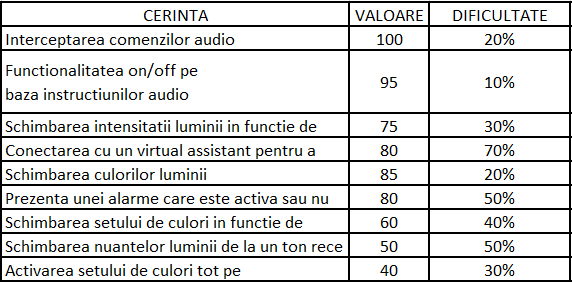

# Smart-Lights-IoT

## Scopul aplicației 

Aplicația Smart Lights IoT este un produs software care permite utilizatorilor să interacționeze cu dispozitive embedded din sfera IoT, în particular vizând simularea unui scenariu de îmbunătățire a dispozitivelor uzuale din locuințe. Scopul acestui produs este de a introduce un sistem de lumini interactiv care, la interceptarea semnalelor sonore, permite setarea unei atmosfere personalizate atât prin schimbarea nuanțelor luminii și a intensității, cât și permiterea jocului de culori.  

Publicul-țintă este reprezentat de persoane de orice vârstă, fiind un plus de confort. Atât copiii, care nu pot să ajungă la întrerupător, cât și persoanele cu dizabilități pot utiliza acest dispozitiv, dându-le independență pentru o activitate așa simplă precum aprinsul becului. 

## Aria de acoperire a aplicației 

Smart Lights IoT eficientizează mediul de lucru prin setarea unei atmosfere plăcute, aleasă de către fiecare utilizator. Vizează în mică parte domeniul de entertainment, deoarece permite setarea unui joc de culori. De asemenea, un alt feature util este afișarea unui ceas digital pe suportul lămpii. Noutatea pe care acest produs îl aduce este interacțiunea utilizatorului cu sistemul de lumini prin intermediul tiparelor sonore distincte.  

Ne dorim ca produsul final să poate fi integrat cu un home device precum Alexa sau Google Home pentru recunoașterea comenzilor vocale, sau chiar recunoașterea directă a acestora fără necesitatea unui dispozitiv auxiliar. Deoarece complexitatea proiectului depășește cunoștiințele tehnice ale echipei, dar și constrângerile de timp, nu vom implementa aceste features. 

## Grupurile de interese 

În viziunea noastră, produsul poate fi utilizat de către oricine dorește să aibă un ambient de lucru mai productiv, indiferent de momentul zilei. Profilul utilizatorului nu prezintă particularități de personalitate, lumina, intensitatea și jocul de lumini putând fi setate după bunul plac. Fie că este vorba de studenți/elevi care au nevoie de un ambient plăcut în mediul de lucru, persoane a căror profesie sau hobby presupune statul în fața calculatorului sau lectura, persoane care pot ațipi numai cu ajutorul luminii de veghe, utilizarea acestei lămpi nu necesită un set special de abilități din partea utilizatorului.  

## Prioritizarea cerințelor 

Lista cerintelor care urmeaza a fi implementate in cadrul acestui proiect sunt: 

1. Functionalitatea on/off pe baza instructiunilor audio (batut din palme) 

2. Interceptarea comenzilor audio 

3. Schimbarea culorilor luminii 

4. Schimbarea intensitatii luminii in functie de nivelul de  lumina al  ambientului 

5. Prezenta unei alarme care este activa sau nu in functie de optiunea clientului


Functionalitatea 1 este cea care determina (implicit) 80% din functionalitatea totala a produsului. 




In urma analizei Pareto rezulta ca primele doua cerinte (20%) determina 80% din valoarea adusa produsului. 

## Stateful app

O funcțioanlitate este stateful, dacă pentru același input dat aplicației, outputul poate fi diferit din cauza unui input dat anterior. De exemplu aplicația are niște valori default, îi pot da un request prin care să îi schimb acele valori „de sistem”. Apoi, pentru un input dat aplicației, să se genereze un output diferit în funcție de valoarea de sistem anterior menționată. 

In cazul nostru, becul are o valoare default, dar la interceptarea unei valori brightness, el isi va schimba culoarea si intensitatea.

---

## Specificatia JSON

```JSON
{
    "device-name": "SmartBulbs",
    "device-type": "Lightbulb",
    "buffers-count": 2,
    //How the buffers should look like
    "input-buffers":{
        //Via which we simulate the recording of sound
        "MICROPHONE":{
            "token-delimitators": "", //Symbol that separates the tokens in the buffer
            "protocol": "HTTP", // The protocol used to communicate with this buffer
            //The Microphone Input buffer will be activated via a request throught this api
            "prefix": "http://127.0.0.0:9080/microphone/",
            //ptz? + these:
            "buffer-tokens":[//
            {
                //Could either be 
                // /settings - when we want access to microphone settings,
                // /patterns - when we register a new pattern or need to see all the recorded patterns
                "name":"Microphone Action",
                "description":"Input that dictates what option to choose for the microphone",
                "token-type":"string", // 
                "byte-size":8, //Maximum size of the token
                //Must be an upperCase Word
                "regex-rule": "settings|patterns",
                //This is required since it is the action required to happen 
                "optional": false 
            },
            {
                "name":"Micropohne Request Param Key",
                //Basically each of the sound patterns described consist of a string 
                //Could Also be sensitivity=value as a token
                // Could also be newPattern=patternValue
                "description": "",                
                "token-type":"string",
                "byte-size":256,
                //each "1" represents a clap or a sound, and "0" represents 0.5 seconds of silence 
                //E.g: https://localhost:8080/micropohne?record=100101  translatest to CLAP-1second silence-CLAP-CLAP
                //E.g: https://localhost:8080/micropohne/settings?sensitivity=3 set sensitivity to 3
                //E.g: https://localhost:8080/micropohne/settings?newPattern=10011&mapsTo=START_LIGHTS_PATTERN&colorPattern=RED-3-BLUE-2-GREEN-2
                // register pattern 10011 as a START_LIGHTS_PATTERN with pattern RED 3s, BLUE 2s, GREEN2s
                "regex-rule": "^&newPattern|^&mapsTo|^&color|^&colorPattern|^&sensitivity|^&record", 
                //"^=1([0,1]*)|^=[1-5]|^=([A-Z]*_)+[A-Z]+|^=([A-Z]+(_\d)*)+(_[A-Z]+_\d)*",
                "optional": false
            },
            {
                "name":"Micropohne Request Param Value",
                "description": "",                
                "token-type":"string",
                "byte-size":256,                
                "regex-rule": "^=1([0,1]*)|^=[1-5]|^=([A-Z]*_)+[A-Z]+|^=([A-Z]+(_\d)*)+(_[A-Z]+_\d)*",
                "optional": false
            }]   
        },
        "PHOTORESISTOR":{
            "token-delimitators": "", //Symbol that separates the tokens in the buffer
            "protocol": "HTTP", // The protocol used to communicate with this buffer
            //The Microphone Input buffer will be activated via a request throught this api
            "prefix": "http://127.0.0.0:9080/bulb/",
             "buffer-tokens":[//
            {
                "name":"Bulb state param keys",
                //Basically each of the sound patterns described consist of a string 
                //Could Also be sensitivity=value as a token
                // Could also be newPattern=patternValue
                "description": "",                
                "token-type":"string",
                "byte-size":256,
                //brightness = the recorded brightness value from the photoresistor
                //presence = motion sensor which specifies the detection of a person nearby
                "regex-rule": "^&brightness|^&presesnce", 
                "optional": false
            },
            {
                "name":"Bulb Request Param Value",
                "description": "",                
                "token-type":"string",
                "byte-size":256,                
                "regex-rule": "^=[0,1]*|^=[true,false]",
                "optional": false
            }]   
        }
    },
    "output-buffers":{
        "BULB_STATE":{
            "token-delimitators": " ",
            "protocol": "HTTP",
            "prefix": "http://localhost:9080/bulb/", //Retrieve the current bulb state configuration
            "caller":"local", // Remote or Local. The caller variable describes who runs this buffer. Either
            "buffer-tokens":[
            {
                "name":"Get Light",
                "description":"This output buffer simulates the light behaviour",
                "token-type":"string", // What type of token should be fuzzed in this position of the buffer
                "byte-size":256,
                "regex-rule": "[a-z*]", // only option is "state"
                "optional": false 
            }]
        },
        "BUZZER":{
            "token-delimitators": "",
            "protocol": "HTTP",
            "prefix": "http://localhost:9080/buzzer/", //Retrieve the current bulb state configuration
            "caller":"local", // Remote or Local. The caller variable describes who runs this buffer. Either
            "buffer-tokens":[
            {
                "name":"Get Buzzer output",
                "description":"This output buffer simulates the sounds played by the buzzer",
                "token-type":"string", // What type of token should be fuzzed in this position of the buffer
                "byte-size":256,
                "regex-rule": "[a-z*]", // only option is "state"
                "optional": false 
            }]
        }
        
    }
}
```

--- 

## Pasi de instalare - Dependinte

### Cmake 

```bash
$ sudo apt-get -y install cmake
```

### Pistachio

```bash
$ sudo add-apt-repository ppa:pistache+team/unstable
$ sudo apt update
$ sudo apt install libpistache-dev
```
###  Mosquitto

```bash
$ sudo apt-add-repository ppa:mosquitto-dev/mosquitto-ppa
$ sudo apt update
$ sudo apt install mosquitto
```

### Paho C / C++

* On Debian based systems this would mean that the following packages have to be installed:

    ```bash
    $ sudo apt-get install build-essential gcc make cmake cmake-gui cmake-curses-gui
    ```

* Also, in order to build a debian package from the source code, the following packages have to be installed

    ```bash
    $ sudo apt-get install fakeroot fakeroot devscripts dh-make lsb-release
    ```

* The documentation requires doxygen and optionally graphviz:

    ```bash
    $ sudo apt-get install doxygen graphviz
    ```

* Install Paho C / C++

    ```
    git clone https://github.com/eclipse/paho.mqtt.c.git
    cd paho.mqtt.c
    git checkout v1.3.8
    cmake -Bbuild -H. -DPAHO_ENABLE_TESTING=OFF -DPAHO_BUILD_STATIC=ON \
        -DPAHO_WITH_SSL=ON -DPAHO_HIGH_PERFORMANCE=ON
    sudo cmake --build build/ --target install
    sudo ldconfig


    git clone https://github.com/eclipse/paho.mqtt.cpp
    cd paho.mqtt.cpp
    cmake -Bbuild -H. -DPAHO_BUILD_STATIC=ON \
        -DPAHO_BUILD_DOCUMENTATION=TRUE -DPAHO_BUILD_SAMPLES=TRUE
    sudo cmake --build build/ --target install
    sudo ldconfig
    ```
* Ensure the OpenSSL development package is installed. Then from the client library base directory run:

    ``` bash
    make
    sudo make install
    ```
---


## Pasi de rulare

1. Rularea comenzii **mosquitto -v** in  terminal.
2. TO DO.